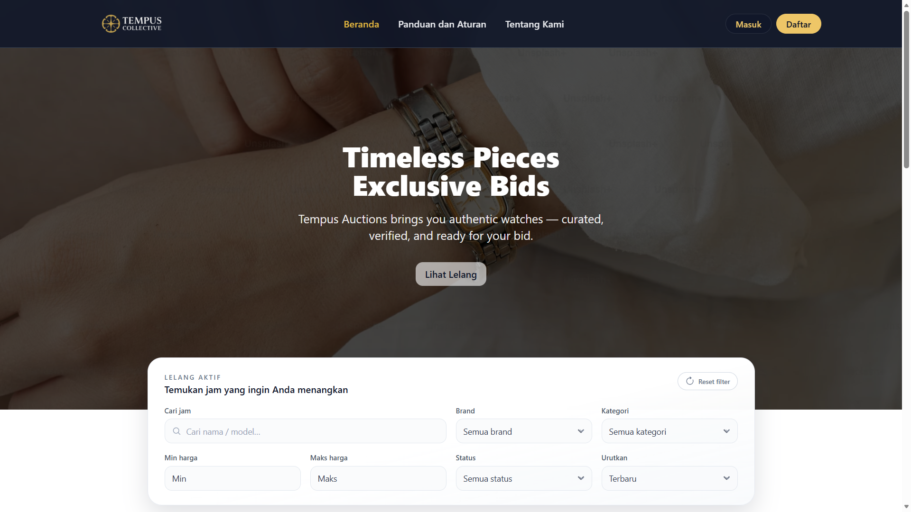
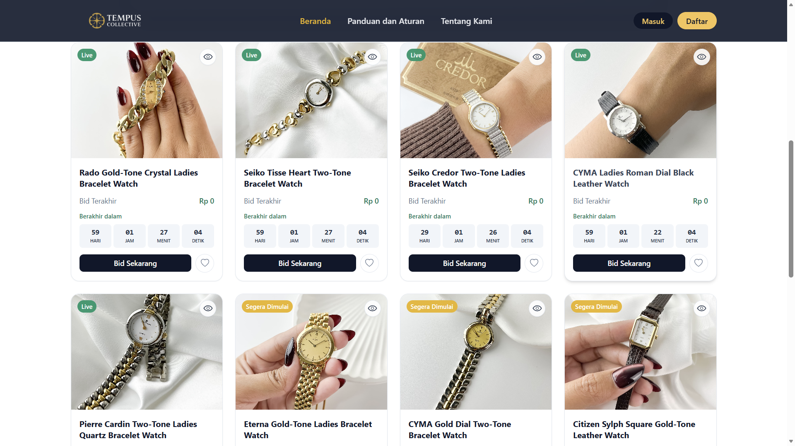
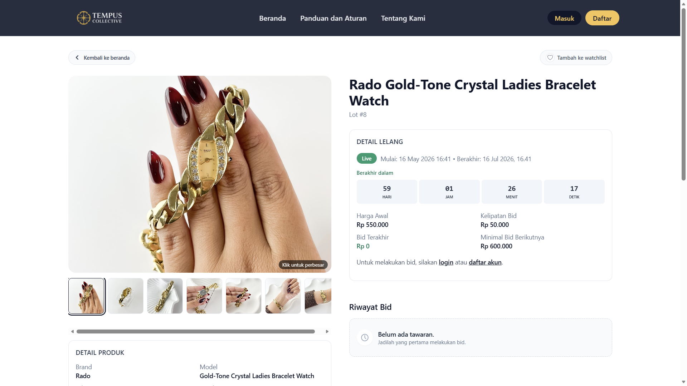

# Tempus Auctions

Tempus Auctions is a web-based watch auction system built with Laravel.

This project was developed as an undergraduate thesis project for PT. Tempus Collective Indonesia. The system supports online watch auctions, bidding, winner selection, invoice generation, payment processing, shipping cost calculation, and email notifications.

## Live Demo

https://auctions.tempuscollective.com

> Payment is configured using Duitku Sandbox for demo and testing purposes.

## Main Features

- User authentication with email verification
- Auction catalog with search, filter, and sorting
- Auction detail page with countdown and real-time highest bid information
- Bidding system with bid validation and increment rules
- Watchlist for saved auction lots
- Winner selection after auction ends
- Invoice generation for auction winners
- Duitku Sandbox payment integration
- RajaOngkir shipping cost calculation
- Email notifications for verification, auction result, payment, account status, and shipment updates
- Admin dashboard for managing products, auction lots, bids, users, invoices, and shipments
- Laravel Scheduler support for automatic auction closing

## Tech Stack

| Category | Technology |
|---|---|
| Backend | Laravel |
| Frontend | Blade, Tailwind CSS, JavaScript |
| Authentication | Laravel Jetstream / Fortify |
| Database | MySQL |
| Email Service | Resend |
| Payment Gateway | Duitku Sandbox |
| Shipping API | RajaOngkir |
| Deployment | Railway |
| Version Control | Git & GitHub |

## Screenshots

### Landing Page



### Auction List



### Auction Detail



## Demo Account

### Buyer Demo

```txt
Email    : demo@example.com
Password : Demo12345!
```

You may also register using your own email address to test the email verification flow.

### Admin Demo

Admin access is available upon request.

> Admin credentials are not publicly shared for security reasons.

## Payment Testing

This project uses Duitku Sandbox for payment testing.

To simulate a successful payment in the sandbox environment, use:

```txt
https://sandbox.duitku.com/payment/demo/demosuccesstransaction.aspx
```

Payment flow:

```txt
User wins an auction
→ Invoice is generated
→ User proceeds to payment
→ Duitku sandbox payment page is opened
→ User simulates successful payment
→ Payment callback or return flow updates the invoice status
```

> No real payment transaction is processed in the demo environment.

## Installation

Clone the repository:

```bash
git clone https://github.com/byochiram/watch-auction-system.git
cd watch-auction-system
```

Install dependencies:

```bash
composer install
npm install
```

Copy the environment file:

```bash
cp .env.example .env
```

Generate application key:

```bash
php artisan key:generate
```

Configure the database in `.env`:

```env
DB_CONNECTION=mysql
DB_HOST=127.0.0.1
DB_PORT=3306
DB_DATABASE=tempus_auctions
DB_USERNAME=root
DB_PASSWORD=
```

Run migration and seeder:

```bash
php artisan migrate --seed
```

Create storage link:

```bash
php artisan storage:link
```

Build frontend assets:

```bash
npm run build
```

Run local development server:

```bash
php artisan serve
```

Open the application:

```txt
http://127.0.0.1:8000
```

## Environment Variables

Configure these variables in `.env`.

### Application

```env
APP_NAME="Tempus Auctions"
APP_ENV=local
APP_KEY=
APP_DEBUG=true
APP_URL=http://127.0.0.1:8000
```

### Database

```env
DB_CONNECTION=mysql
DB_HOST=127.0.0.1
DB_PORT=3306
DB_DATABASE=tempus_auctions
DB_USERNAME=root
DB_PASSWORD=
```

### Mail / Resend

```env
MAIL_MAILER=resend
RESEND_API_KEY=your_resend_api_key
MAIL_FROM_ADDRESS=noreply@example.com
MAIL_FROM_NAME="Tempus Auctions"
QUEUE_CONNECTION=sync
```

### Duitku Sandbox

```env
DUITKU_MERCHANT_CODE=your_duitku_merchant_code
DUITKU_API_KEY=your_duitku_api_key
DUITKU_CALLBACK_URL=http://127.0.0.1:8000/payment/callback
DUITKU_RETURN_URL=http://127.0.0.1:8000/payment/return
DUITKU_MODE=sandbox
```

### RajaOngkir

```env
RAJAONGKIR_API_KEY=your_rajaongkir_api_key
RAJAONGKIR_ORIGIN_DISTRICT_ID=your_origin_district_id
```

> All API values must be filled with your own credentials from each provider. Real credentials are not included in this repository.

## Deployment

This project is deployed using Railway.

Production setup includes:

- Laravel web service
- MySQL database service
- Custom domain
- Resend email API
- Duitku Sandbox payment gateway
- RajaOngkir shipping API
- Railway volume for uploaded images
- Laravel Scheduler support for auction closing

### Railway Build Command

```bash
npm run build
```

### Railway Pre-deploy Command

```bash
php artisan optimize:clear && php artisan migrate --force && php artisan db:seed --class=AdminSeeder --force && php artisan optimize
```

### Railway Start Command

```bash
mkdir -p storage/app/public/products && rm -rf public/storage && php artisan storage:link && php artisan serve --host=0.0.0.0 --port=$PORT
```

## Auction Scheduler

Auction closing is handled using Laravel Scheduler.

The scheduler is responsible for:

```txt
Checking ended auction lots
Selecting the highest bidder
Updating auction status
Generating invoice data
Sending notification email
Handling unpaid or expired invoices
```

Recommended scheduler command:

```bash
php artisan schedule:run --verbose --no-interaction
```

Recommended Railway cron schedule:

```txt
*/5 * * * *
```

## Security Notes

- Real credentials and API keys are stored in environment variables.
- Production secrets are not included in this repository.
- Admin credentials are not publicly shared.
- Duitku is configured in sandbox mode for demo and testing.

## Developer

Developed by **Rosidah Rahmati**.

```txt
Undergraduate Thesis Project
Department of Informatics
Faculty of Science and Mathematics
Universitas Diponegoro
2026
```

## Repository

```txt
https://github.com/byochiram/watch-auction-system
```

## License

This project is intended for academic final project documentation and portfolio purposes.